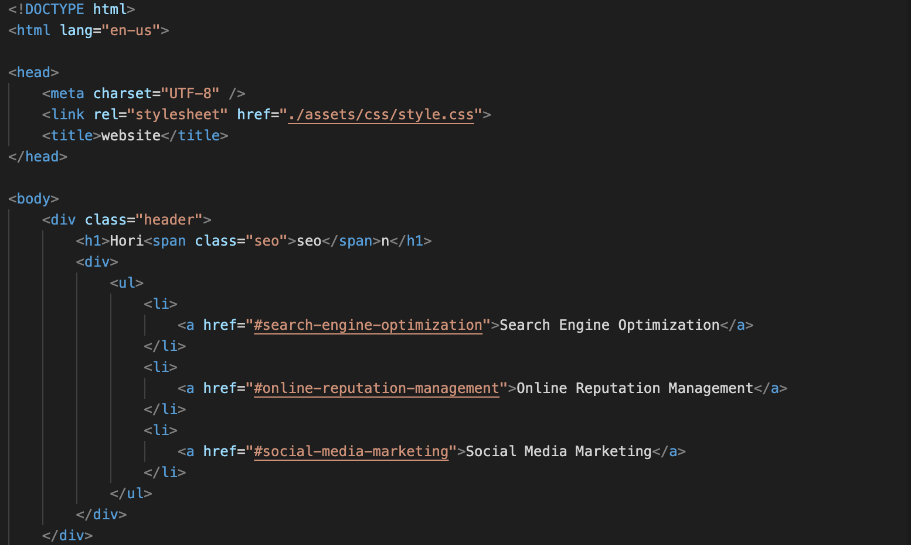
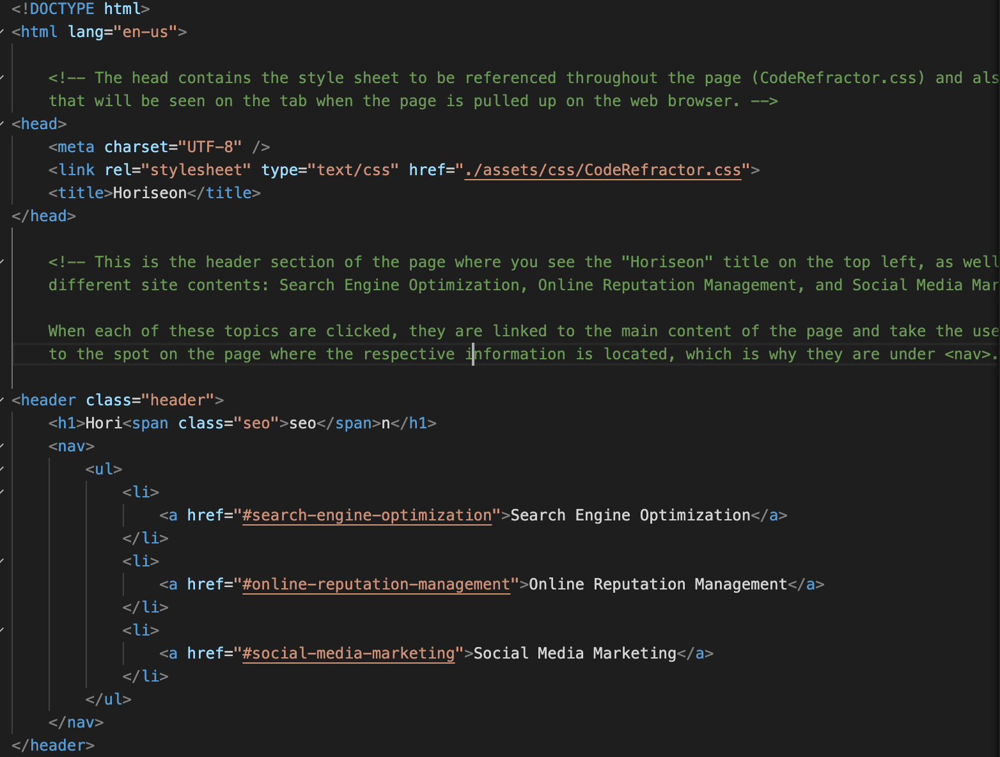
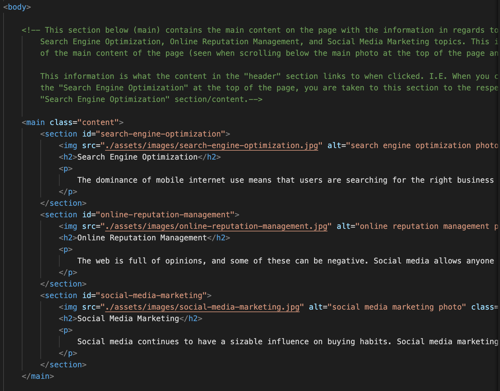
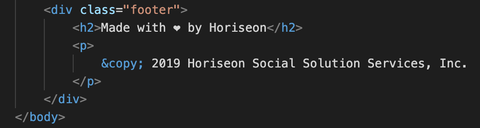
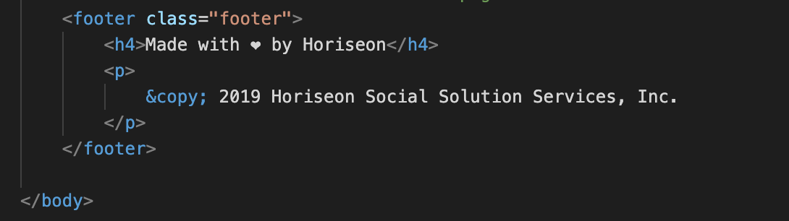
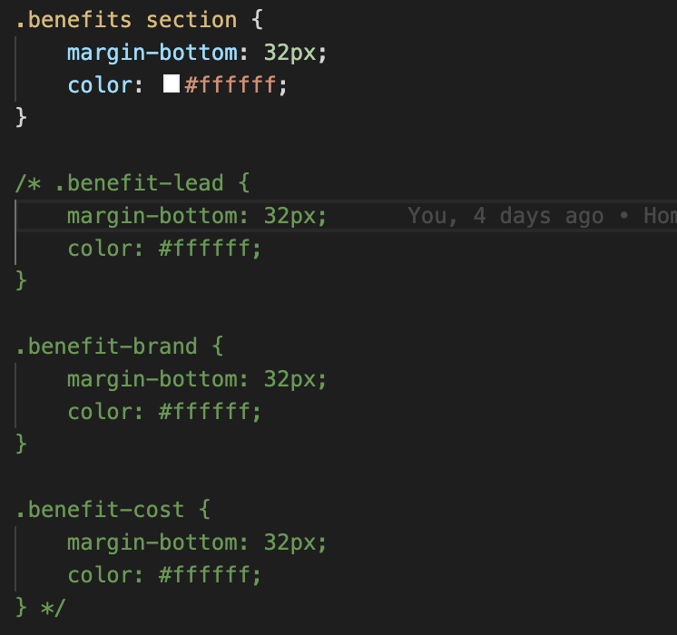
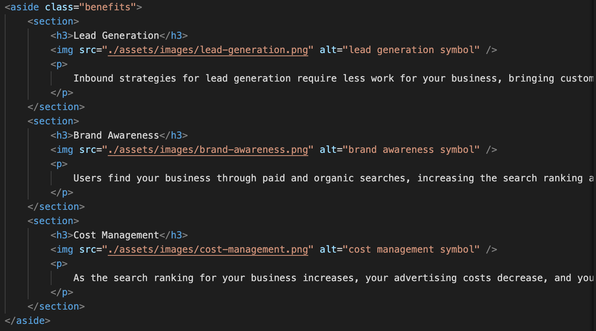

# Homework Assignment 1 - Code Refactor

Marketing Agency - Site Accessibility Optimization

Problem: A marketing agency is looking to have their site optimized to both meet accessibility standards, and to also be fully optimized for search engines.

**User Story**

```
AS A marketing agency
I WANT a codebase that follows accessibility standards
SO THAT our own site is optimized for search engines
```

**Deliverables**

```
GIVEN a webpage meets accessibility standards
WHEN I view the source code
THEN I find semantic HTML elements
WHEN I view the structure of the HTML elements
THEN I find that the elements follow a logical structure independent of styling and positioning
WHEN I view the image elements
THEN I find accessible alt attributes
WHEN I view the heading attributes
THEN they fall in sequential order
WHEN I view the title element
THEN I find a concise, descriptive title
```

## HTML Accessibility Modifications & Findings

The first issue noticed was the Search Engine Optimization link at the top of the page did not direct the user to the respective spot on the page where that information existed when clicked. This was because the content it was trying to link to had an element that did not have an id attribute called out, only a class attribute. 

Another issue observed was that all of the images did not have alt tags with them.

Continuing on, the structure of the HTML file was not clear. For example, the footer used a *div* element instead of a *footer* element. Also, the header was contained in the body, and was also under a *div* element and not a *header* element. Within the body itself, each section wasnt clearly distinguished since these sections were also under *div* elements. So, it was adjusted from a *div* to a *section* and from a *div* to an *aside* to make it clear that each part of the site fit under a certain section of the page. The aside was fitting for the section that you see on the right-hand-side of the page since it is essentially "aside" of the main content to the left of it.

See below for the before/after of the header, body, and body elements, respectively:

**Header content before:**



**Header content after:**



Above in the before, you can see that the header is in the body and it has a *div* element as opposed to a *header* element. In the after, the *header* is under a *header* element and is before the body.

**Body content before:**



**Body content after:**


You can see in the above screenshots that before the html was cleaned up, almost everything is under a *div* element, making it confusing as to what the content really is in relation to the page. The after screenshot shows this issue cleaned up to make the portion being shown under the element of *main*, since it is the main content of the page, and then each item within the *main* element, is under a *section* element since they are each different sections within the main content.

**Footer content before:**



**Footer content after:**



The footer before is under a *div* element. In order to make this meet accessibility standards and to make it more readable/understandable to the reader, the *div* was changed to a *footer* element, which you can see in the after photo.

Along with those previously mentioned above, additional adjustments had to be made including:

* Changing the footer *h2* element to an *h4* since the previous *h* element used was an *h3* in the *aside* section. This adjustment to the next heading element number follows proper semantics.


## CSS Accessibility Modifications & Findings

The css style sheet had multiple areas warranting improvement. There were redundant style classes created, just under different names. These were able to be consolidated into one based on what the style was trying to do.

For example, for the *aside* element in the html, each individual section had its own style class in the CSS file, even though they all had the same elements. Because they are under the same parent element, you can create one style for all three. See below for the changes made, and note that the commented out classes were the original redundant ones, with the *benefits section* being the updated one:



Because the parent element *aside* specified a class of benefits, and because benefits was already a class in the CSS, these three classes could be consolidated into one class since they each fell under the same parent element of *aside* under the element of *section*:



This was done for multiple classes within the CodeRefractor.css in order to consolidate and clean up everything so that the redundancy was eliminated.

The order of the classes in the css was also inconsistent. For example, for the class .content, the initial .content class was placed at the top of the style.css, and then the ".content section img", ".content section", etc. were further down the page after unrelated classes. Grouping the related classes together makes the style.css more understandable. 

The final style.css and index.html codes looked both cleaner, more concise, and easier to follow since they were adjusted to be more accessible and redundancy was eliminated.

## Credits

The following resources were referenced during the project process:

* W3Schools - [HTML Accessibility](https://www.w3schools.com/html/html_accessibility.asp "HTML Accessibility")
* W3Schools - [HTML Attributes](https://www.w3schools.com/tags/ref_attributes.asp "HTML Attributes") 
* W3Schools - [CSS Toutorials](https://www.w3schools.com/css/default.asp "CSS Toutorials")


